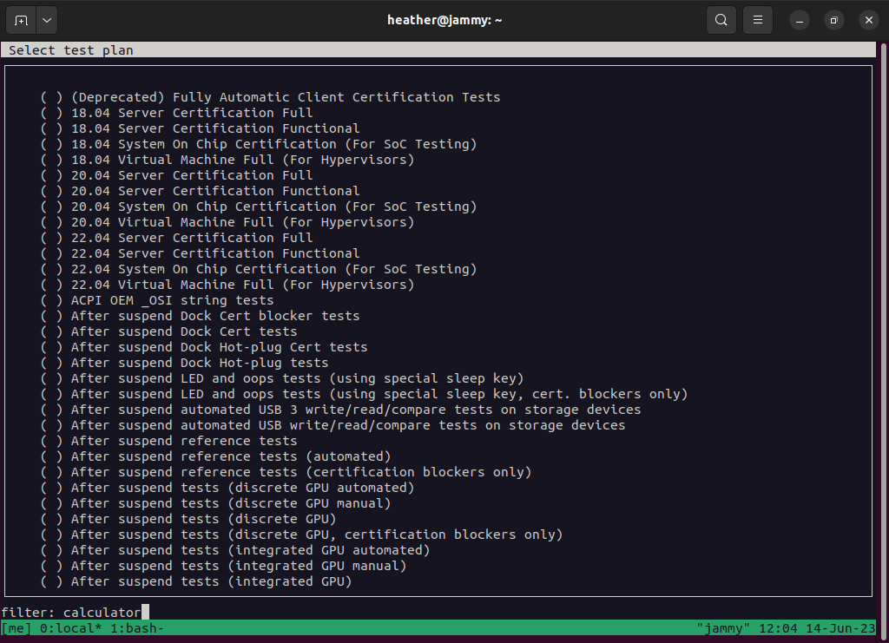
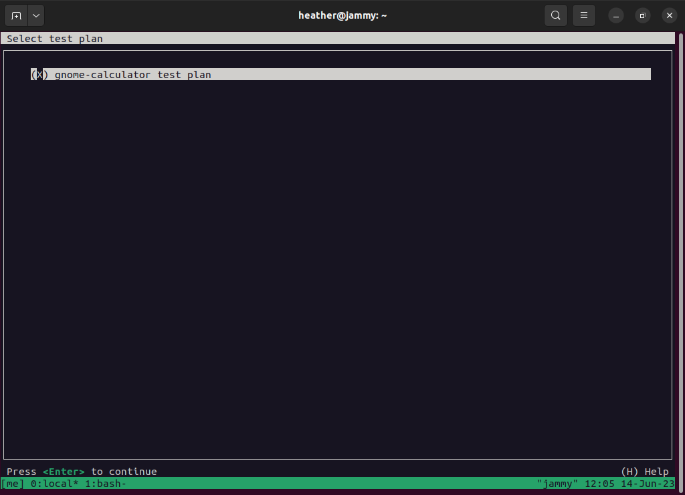
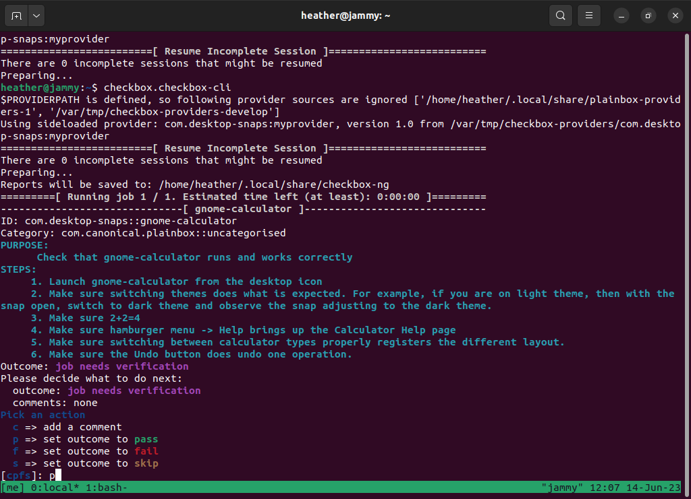
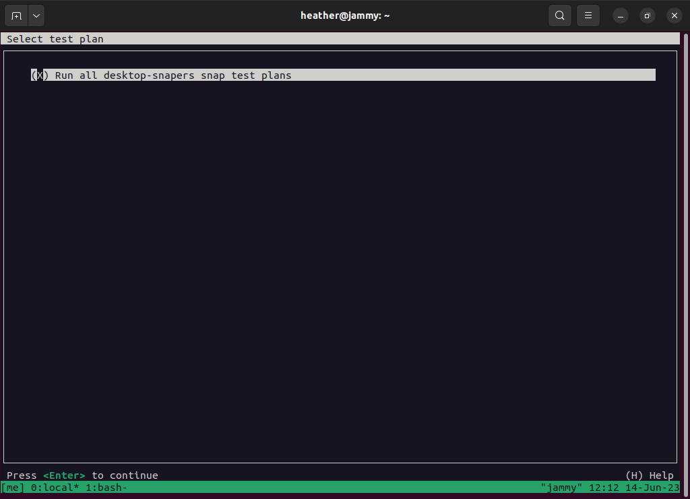

This is a how-to guide on setting up checkbox on a 22.04 VM and executing manual tests with it. We ultimately would like to automate the checkbox test cases, with the use of other tools down the road.

Because a GitHub runner, running a workflow on ‘ubuntu-latest’, will be running 22.04. So I’m starting with a fresh 22.04 VM.

## First time setup

The very first time checkbox is setup on a system for testing, you will need to do a small amount of one-time setup tasks

### General tools needed

```
jammy:~$ sudo apt install python3-pip python3-distutils-extra
```

### Setting up checkbox

```
jammy:~$ sudo snap install checkbox -classic
jammy:~$ sudo snap install checkbox22
```

### Create an empty side-loaded provider

```
jammy:~$ jammy:~$ mkdir -p /var/tmp/checkbox-providers && cd /var/tmp/checkbox-provider
jammy:/var/tmp/checkbox-providers$ checkbox.checkbox-cli startprovider --empty com.desktop-snaps:myprovider
```

## Creating the first test plan for the provider

This is most useful really for someone doing the initial setup of checkbox, including writing the very first project test plans. 

### Create a test plan

```
jammy:/var/tmp/checkbox-providers/com.desktop-snaps:myprovider$ mkdir units && cd units
jammy:/var/tmp/checkbox-providers/com.desktop-snaps:myprovider/units$ vim gnome-calculator.pxu
plugin: manual
id: my-first-job
flags: simple
_description:
 PURPOSE:
   	Check that gnome-calculator runs and works correctly
 STEPS:
  	1. Launch gnome-calculator from the desktop icon
  	2. Make sure the theme is correct
  	3. Make sure 2+2=4
  	4. Make sure hamburger menu -> Help brings up the Calculator Help page

unit: test plan
id: gnome-calculator-tp
name: gnome-calculator test plan
include: my-first-job
```

### Run the test plan

```
jammy:/var/tmp/checkbox-providers/com.desktop-snaps:myprovider$ checkbox.checkbox-cli
$PROVIDERPATH is defined, so following provider sources are ignored ['/home/heather/.local/share/plainbox-providers-1', '/var/tmp/checkbox-providers-develop']
Using sideloaded provider: com.desktop-snaps:myprovider, version 1.0 from /var/tmp/checkbox-providers/com.desktop-snaps:myprovider
=========================[ Resume Incomplete Session ]==========================
There are 0 incomplete sessions that might be resumed
Preparing...
Reports will be saved to: /home/heather/.local/share/checkbox-ng
=========[ Running job 1 / 1. Estimated time left (at least): 0:00:00 ]=========
--------------------------------[ my-first-job ]--------------------------------
ID: com.desktop-snaps::my-first-job
Category: com.canonical.plainbox::uncategorised
PURPOSE:
  	Check that gnome-calculator runs and works correctly
STEPS:
 	1. Launch gnome-calculator from the desktop icon
 	2. Make sure the theme is correct
 	3. Make sure 2+2=4
 	4. Make sure hamburger menu -> Help brings up the Calculator Help page
Outcome: job needs verification
Please decide what to do next:
  outcome: job needs verification
  comments: none
Pick an action
  c => add a comment
  p => set outcome to pass
  f => set outcome to fail
  s => set outcome to skip
[cpfs]: p
WARNING:checkbox-ng.launcher.stages:Using side-loaded providers disabled the certification report
 (green checkmark) : my-first-job
file:///home/heather/.local/share/checkbox-ng/submission_2023-06-01T15.51.39.639232.html
file:///home/heather/.local/share/checkbox-ng/submission_2023-06-01T15.51.39.639232.junit.xml
WARNING:plainbox.providers.__init__:Using sideloaded provider: com.desktop-snaps:myprovider, version 1.0 from /var/tmp/checkbox-providers/com.desktop-snaps:myprovider
WARNING:plainbox.providers.__init__:Using sideloaded provider: com.desktop-snaps:myprovider, version 1.0 from /var/tmp/checkbox-providers/com.desktop-snaps:myprovider
WARNING:plainbox.providers.__init__:Using sideloaded provider: com.desktop-snaps:myprovider, version 1.0 from /var/tmp/checkbox-providers/com.desktop-snaps:myprovider
file:///home/heather/.local/share/checkbox-ng/submission_2023-06-01T15.51.39.639232.tar.xz
```

## Test Plans available

The test plans live in the `units/` directory and they are for the following snaps:

  * cheese
  * eog
  * epiphany
  * evince
  * five-or-more
  * gedit
  * glade
  * gnome-2048
  * gnome-boxes
  * gnome-calculator
  * gnome-calendar
  * gnome-characters
  * gnome-chess
  * gnome-clocks
  * gnome-contacts
  * gnome-dictionary
  * gnome-font-viewer
  * gnome-hitori
  * gnome-klotski
  * gnome-logs
  * gnome-mahjongg
  * gnome-mines
  * gnome-recipes
  * gnome-robots
  * gnome-sudoku
  * gnome-system-monitor
  * gnome-taquin
  * gnome-text-editor
  * gnome-tetravex
  * gnome-weather
  * iagno
  * lightsoff
  * quadrapassel
  * swell-foop
  * tali

### Running one test

Run checkbox from the command line:
```
jammy:~$ checkbox.checkbox-cli
```

Search the database with the "/" character. Start typing the app for testing. For example, you can search for "calculator" to discover the gnome-calculator test plan.



Then arrow down to highlight the line; space bar to select it. Hit enter.



Hit T to begin testing.



### Running all tests

Follow the same steps as for "Running one test" except search for "snap test" to find the test plan called "Run all desktop-snapers snap test plans".



## Updating a test plan

The test plans are in the "units" directory. Feel free to create a pull request with any additions :)
